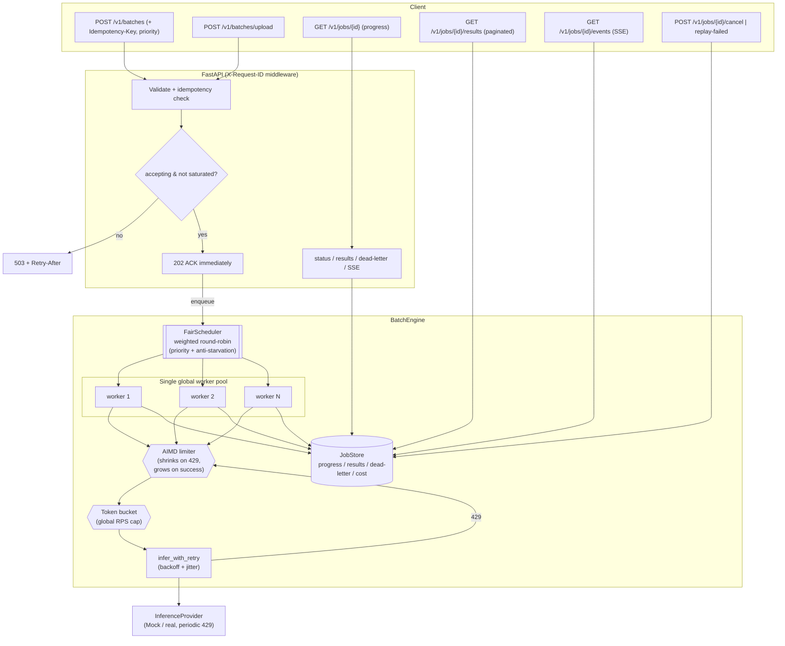

# Architecture

## System flow

## Why this design

| Requirement | How it is met |
|---|---|
| **Immediate acknowledgment** | `submit` enqueues into the scheduler and returns `202` with `job_id` + status URLs; never blocks on processing. |
| **Concurrent processing** | A single global worker pool drains the scheduler in parallel. |
| **Fair multi-tenancy** | `FairScheduler` uses weighted round-robin (priority high/normal/low) so one huge batch can't monopolize workers and small jobs finish fast; every job has weight ≥ 1 so nothing starves. |
| **Bounded concurrency** | Capped by the worker pool size, the bounded scheduler, **and** an AIMD limiter (≤ `GLOBAL_MAX_CONCURRENCY`) across all jobs. Bounds in-flight work (see memory note). |
| **Proactive rate limiting** | Token bucket enforces a global RPS ceiling; AIMD shrinks concurrency on 429s and grows it back on success — preventing stampedes before they happen. |
| **Rate-limit recovery** | `infer_with_retry` retries 429s with exponential backoff + jitter, honoring `Retry-After`. |
| **Resilience** | Any per-prompt failure (exhausted retries, non-retryable, unexpected) is isolated to the dead-letter queue; the worker and batch continue. |
| **API backpressure** | `503 + Retry-After` once `MAX_ACTIVE_JOBS` are running. |
| **Idempotency** | `Idempotency-Key` returns the original job instead of duplicating work. |
| **Observability** | `/metrics` (counters/gauges/histograms), structured JSON logs with `request_id`/`job_id`/`prompt_id`, cost accounting. |
| **Health model** | `/livez` (alive), `/readyz` (accepting & not saturated) for clean rolling deploys. |
| **Graceful shutdown** | Stop accepting → drain in-flight for `GRACEFUL_SHUTDOWN_SECONDS` → cancel rest → mark unfinished jobs cancelled. |
| **Recoverability** | Dead-letter inspection + `replay-failed` to re-run only failed prompts. |

## Concurrency model details

Everything runs on one asyncio event loop:

1. **Scheduler** holds per-job queues and serves them by weighted round-robin
   with deficit credits (priority weights 4/2/1). `pop()` is synchronous and
   non-blocking.
2. **Global worker pool** (`WORKER_POOL_SIZE` coroutines) loops: acquire an AIMD
   permit → `pop()` an item → token-bucket gate → `infer_with_retry` → record
   result. Workers exit when the scheduler drains, so there are no idle tasks
   between batches; the next submit respawns them.
3. **AIMD limiter** is the system-wide concurrency cap; it self-tunes to the
   provider's real capacity. Because there is no preemption between `await`
   points, the shared counters/result maps need no locks.

> **Memory note (honest scoping).** The scheduler/worker pool bound *in-flight*
> work, not total process memory: the submitted prompts and aggregated results
> live in RAM for the job's lifetime, and uploads are read fully into memory.
> Fine for thousands of prompts. Truly flat memory on huge inputs needs
> streaming/file-backed ingestion and a spill-to-DB result store (README
> "Tradeoffs"; ADR-005).

See **[architecture-decisions.md](architecture-decisions.md)** for the ADRs
behind each choice.
