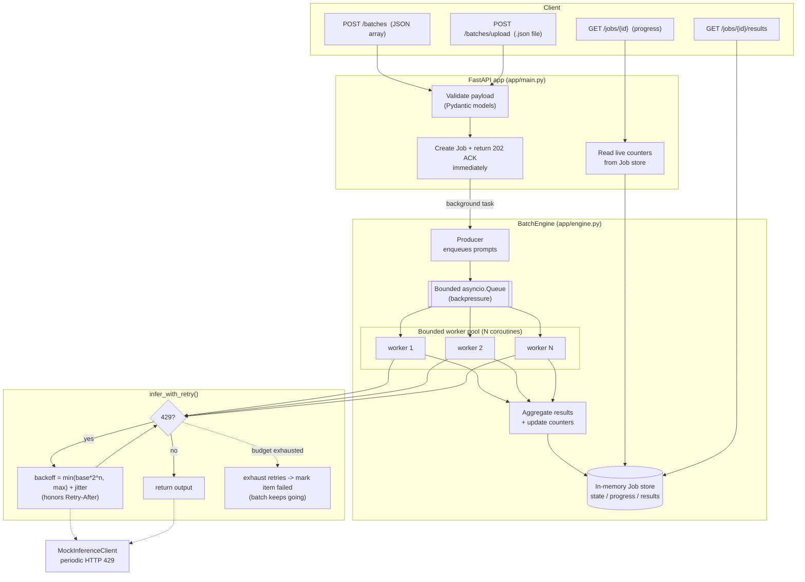

# Architecture

## System flow

## Why this design

| Requirement | How it is met |
|---|---|
| **Immediate acknowledgment** | `submit()` registers the `Job` and schedules an `asyncio` background task, then returns `202 Accepted` with `job_id` + status URLs. The request never blocks on processing. |
| **Concurrent processing** | A fixed set of `WORKER_POOL_SIZE` worker coroutines drain a shared queue, so prompts are processed in parallel instead of sequentially. |
| **Bounded concurrency** | Concurrency is capped two ways: a fixed number of workers (in-flight calls) and a `maxsize`-bounded queue (pending work). Memory stays flat even for huge batches. |
| **Rate-limit handling** | `infer_with_retry()` catches `RateLimitError` (429) and sleeps using exponential backoff + jitter, honoring a `Retry-After` hint, up to `MAX_RETRIES`. Prompts are never dropped on a transient 429. |
| **Resilience** | A prompt that exhausts retries (or hits a non-retryable 500) is recorded as a failed item; the worker and the rest of the batch continue. |
| **Result aggregation** | Each worker writes its `InferenceResult` into the job's result map and increments counters; `/jobs/{id}/results` returns the compiled JSON. |
| **Job status API** | Workers update `completed/succeeded/failed/retries` atomically (single-threaded event loop), so `/jobs/{id}` reports real-time progress like `400/1000`. |

## Concurrency model details

The engine uses a **producer / bounded-queue / worker-pool** pattern on a single
asyncio event loop:

1. **Producer** iterates the batch and `await queue.put(item)`. Because the queue
   is bounded, `put` suspends when full — this is backpressure that keeps memory
   bounded regardless of batch size.
2. **Workers** (`N = WORKER_POOL_SIZE`) loop on `await queue.get()`, process one
   prompt at a time, and call `queue.task_done()`. The pool size is the hard cap
   on simultaneous inference calls.
3. **Completion** is detected with `await queue.join()` (all items processed),
   after which the workers are cancelled and the job is marked `completed`.

Because everything runs on one event loop, the shared counters and result map
need no locks — there is no preemption between `await` points where we mutate
them. The only lock is inside the mock client, used to make its 429 cadence
deterministic across concurrent callers.
